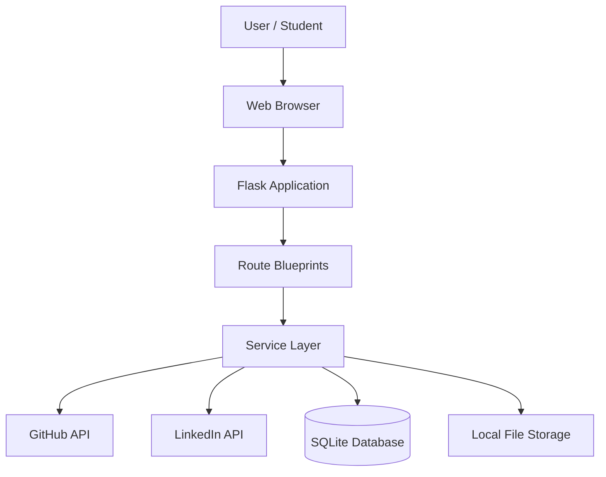
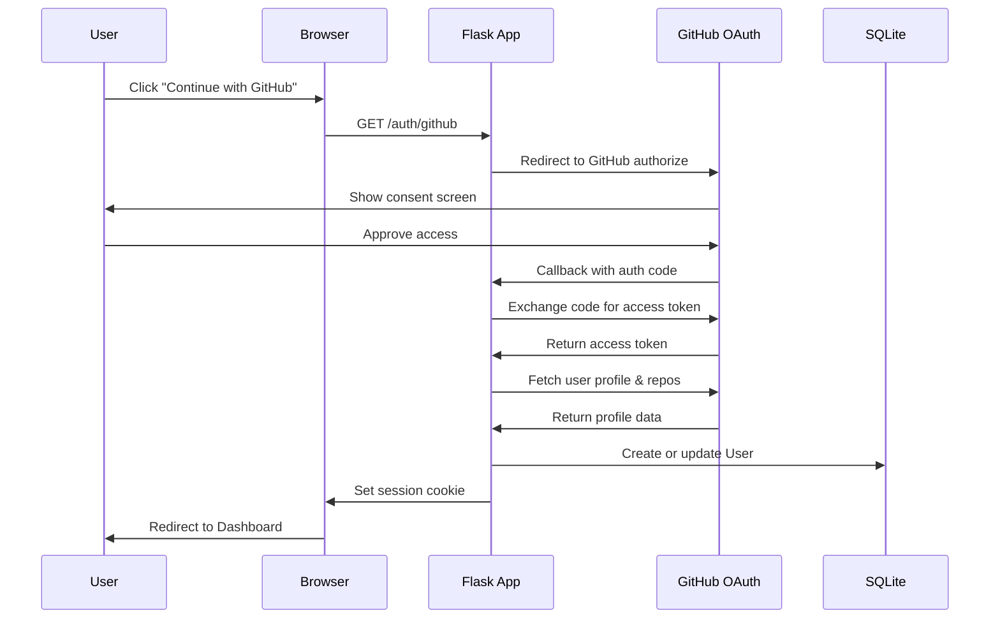
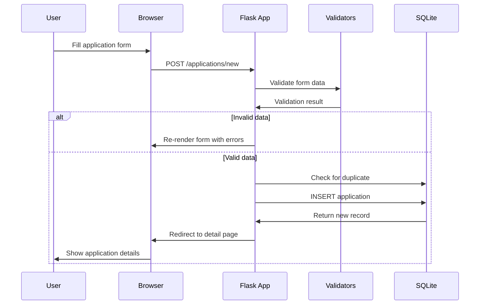
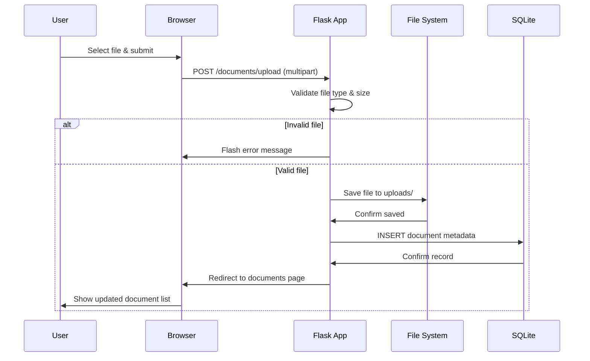

# Architecture Diagrams

## System Architecture

```mermaid
flowchart TD
    User[User / Student]
    Browser[Web Browser]
    Flask[Flask Application]
    Routes[Route Blueprints]
    Services[Service Layer]
    GitHubAPI[GitHub API]
    LinkedInAPI[LinkedIn API]
    SQLite[(SQLite Database)]
    Uploads[Local File Storage]

    User --> Browser
    Browser --> Flask
    Flask --> Routes
    Routes --> Services
    Services --> GitHubAPI
    Services --> LinkedInAPI
    Services --> SQLite
    Services --> Uploads
```

## Login Sequence (GitHub OAuth)

```mermaid
sequenceDiagram
    participant U as User
    participant B as Browser
    participant F as Flask App
    participant G as GitHub OAuth
    participant DB as SQLite

    U->>B: Click "Continue with GitHub"
    B->>F: GET /auth/github
    F->>G: Redirect to GitHub authorize
    G->>U: Show consent screen
    U->>G: Approve access
    G->>F: Callback with auth code
    F->>G: Exchange code for access token
    G->>F: Return access token
    F->>G: Fetch user profile & repos
    G->>F: Return profile data
    F->>DB: Create or update User
    F->>B: Set session cookie
    B->>U: Redirect to Dashboard
```

## Create Application Sequence

```mermaid
sequenceDiagram
    participant U as User
    participant B as Browser
    participant F as Flask App
    participant V as Validators
    participant DB as SQLite

    U->>B: Fill application form
    B->>F: POST /applications/new
    F->>V: Validate form data
    V->>F: Validation result
    alt Invalid data
        F->>B: Re-render form with errors
    else Valid data
        F->>DB: Check for duplicate
        F->>DB: INSERT application
        DB->>F: Return new record
        F->>B: Redirect to detail page
        B->>U: Show application details
    end
```

## Upload Document Sequence

```mermaid
sequenceDiagram
    participant U as User
    participant B as Browser
    participant F as Flask App
    participant FS as File System
    participant DB as SQLite

    U->>B: Select file & submit
    B->>F: POST /documents/upload (multipart)
    F->>F: Validate file type & size
    alt Invalid file
        F->>B: Flash error message
    else Valid file
        F->>FS: Save file to uploads/
        FS->>F: Confirm saved
        F->>DB: INSERT document metadata
        DB->>F: Confirm record
        F->>B: Redirect to documents page
        B->>U: Show updated document list
    end
```
